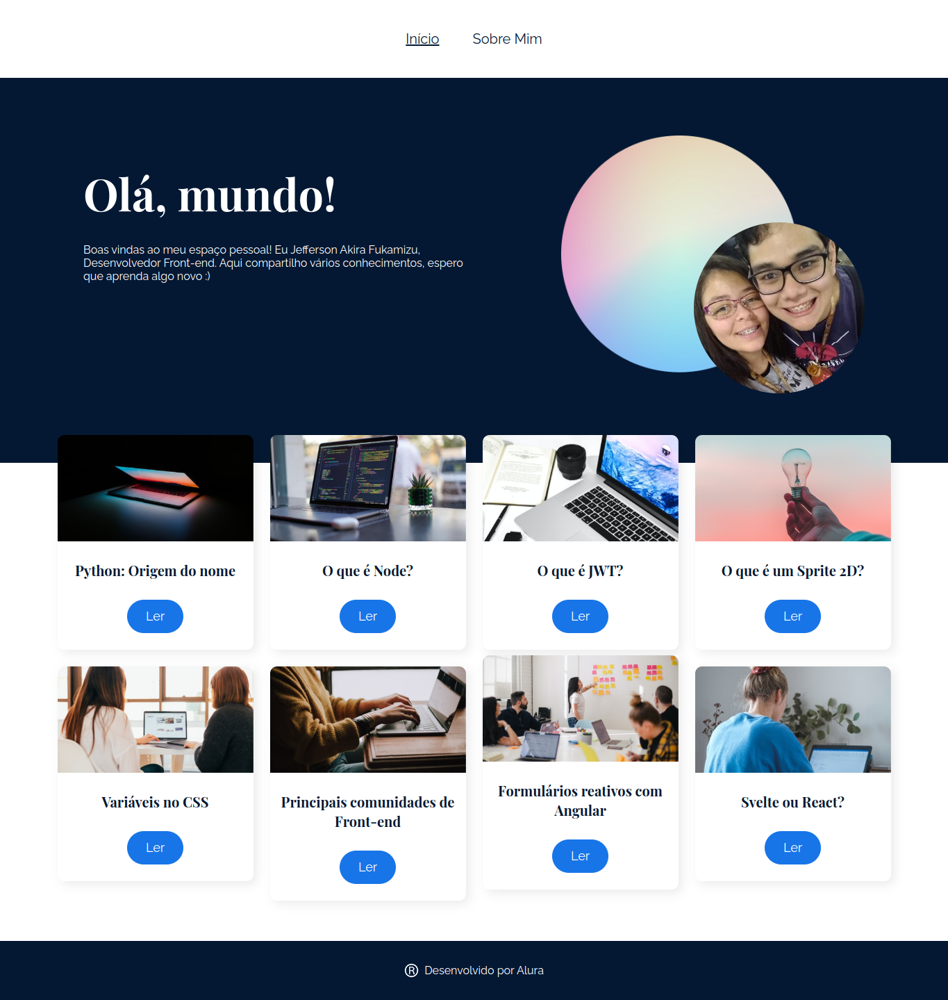

# Ola Mundo

Projeto desenvolvido durante o curso React: desenvolvendo em React Router em javascript.

## Link do Vercel
Para acessar a página no vercel [clique aqui](https://ola-mundo-iota.vercel.app/)

## Instalação
Use o comando `npm install` no terminal para instalar as dependências

## Inicialização
Use o comando `npm start` para inicializar o projeto
